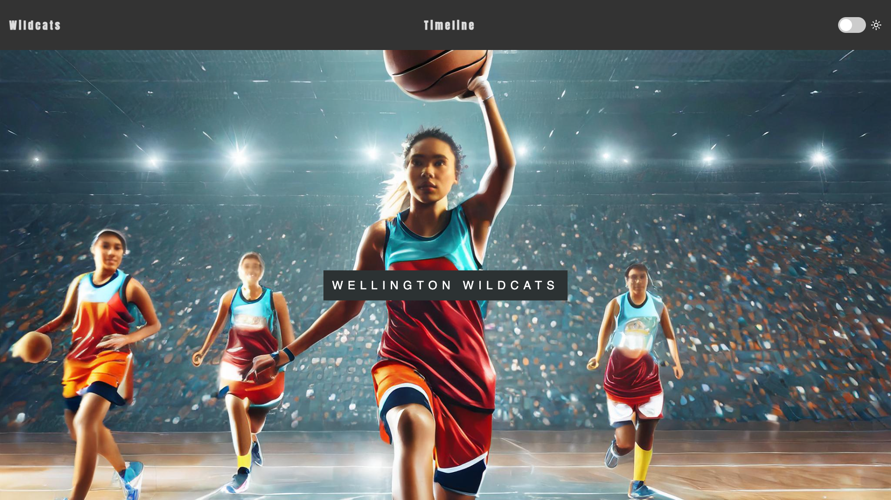

## Introduction

In this project, you will use the skills you developed in the [More web](https://projects.raspberrypi.org/en/pathways/more-web) path to create an interactive website using modern design skills so that you can share a part of your world with others.

Love animals? Games? Books? Build a website about it! Turn your favourite things into a website. Share fun facts, create quizzes, or write reviews — show everyone why you love what you love!

You will:
+ Build an interactive website to share a part of your world
+ Create multiple pages and link them together
+ Use CSS to style your website
+ Use JavaScript to add interactivity to your site

--- no-print ---

--- task ---

### Try it

Can you identify the ways CSS and JavaScript have been used to make this website interactive? What HTML elements have been used to present the information?

**Coding Journey**: [See inside](https://editor.raspberrypi.org/en/projects/share-your-world-coding){:target="_blank"}

<iframe src="https://editor.raspberrypi.org/en/embed/viewer/share-your-world-coding" width="100%" height="800" frameborder="0" marginwidth="0" marginheight="0" allowfullscreen> </iframe>

--- collapse ---

---
title: Images in this project
---

Images included in this project were created using generative AI. Model: Firefly Image 2.

--- /collapse ---

--- /task ---

--- /no-print ---

### PROJECT BRIEF: Build an interactive website!

Create an interactive website that invites a user to experience something they cannot otherwise. Use your HTML, CSS, and JavaScript skills to welcome someone into a part of your world! Share your culture, interests, hobbies, or expertise with the world. It is what the world wide web was designed for! 

Your website should:
+ Include more than one page and use a navigation bar
+ Use a grid or flex layout 
+ Use JavaScript to update a page element
+ Include alt-text for images

Your website could:
+ Have different (adaptive) layouts
+ Use the JavaScript observer to animate page elements
+ Use multiple JavaScript events to update a page element
+ Make use of localStorage to keep changes

--- no-print ---

### Get inspiration

--- task ---

As you look at these webpages, consider what makes them useful and informative, as well as fun and accessible:

⭐ Share your finished project for a chance of it being featured here.

**Wildcats** [See inside](https://editor.raspberrypi.org/en/projects/share-your-world-wildcats){:target="_blank"}

<iframe src="https://editor.raspberrypi.org/en/embed/viewer/share-your-world-wildcats" width="100%" height="800" frameborder="0" marginwidth="0" marginheight="0" allowfullscreen> </iframe>

--- collapse ---

---
title: Images in this project
---

Images included in this project were created using generative AI. Model: Firefly Image 2.

--- /collapse ---

--- /task ---

--- /no-print ---

--- print-only ---

--- /print-only ---
