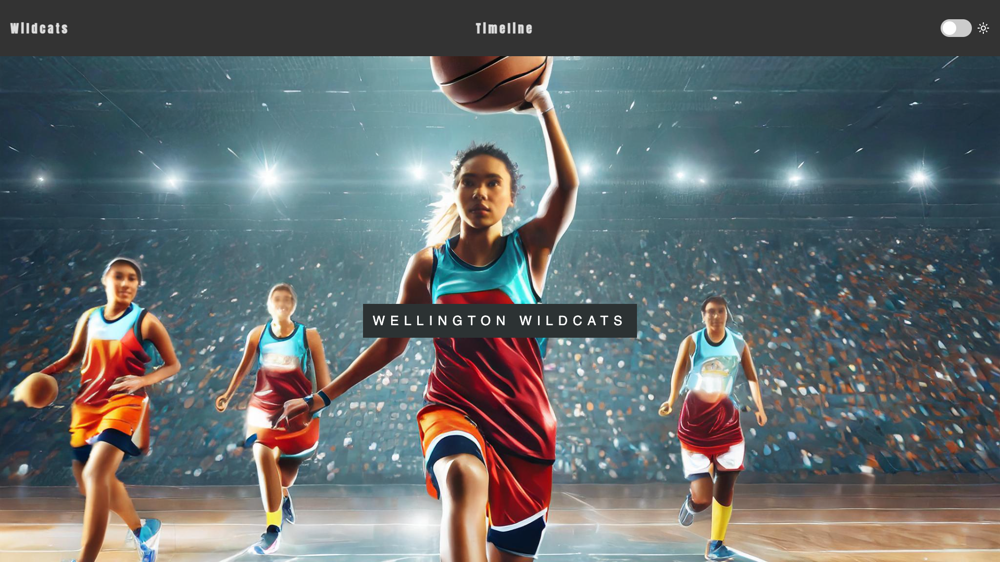

## Inleiding

In dit project ga je de vaardigheden die je hebt ontwikkeld in het [More web](https://projects.raspberrypi.org/en/pathways/more-web)-pad gebruiken om een interactieve website te maken met behulp van moderne ontwerpvaardigheden, zodat je een deel van je wereld met anderen kunt delen.

Houd je van dieren? Spellen? Boeken? Bouw een website erover! Maak een website van je favoriete dingen. Deel leuke weetjes, maak quizzen of schrijf recensies: laat iedereen zien waarom je van iets houdt!

Je gaat:

- Bouw een interactieve website om een deel van je wereld te delen
- Maak meerdere pagina's en koppel ze aan elkaar
- Gebruik CSS om je website op te maken
- Gebruik JavaScript om interactiviteit aan je website toe te voegen

\--- no-print ---

\--- task ---

### Probeer het uit

Kun je de manieren identificeren waarop CSS en JavaScript zijn gebruikt om deze website interactief te maken? Welke HTML-elementen zijn gebruikt om de informatie te presenteren?

**Codeer Avontuur**: [Bekijk van binnen](https://editor.raspberrypi.org/en/projects/share-your-world-coding){:target="_blank"}

<iframe src="https://editor.raspberrypi.org/en/embed/viewer/share-your-world-coding" width="100%" height="800" frameborder="0" marginwidth="0" marginheight="0" allowfullscreen> </iframe>

\--- collapse ---

---

## title: Afbeeldingen in dit project

Afbeeldingen die zijn opgenomen in dit project zijn gemaakt met behulp van generatieve AI. Model: Firefly Image 2.

\--- /collapse ---

\--- /task ---

\--- /no-print ---

### PROJECTPLAN: Bouw een interactieve website!

Maak een interactieve website die gebruikers uitnodigt om iets te ervaren wat ze anders niet zouden kunnen. Gebruik je HTML, CSS en JavaScript vaardigheden om iemand in een deel van je wereld te verwelkomen! Deel jouw cultuur, interesses, hobby's of expertise met de wereld. Daar is het wereldwijde web voor ontworpen!

Je website moet:

- Meer dan één pagina bevatten en een navigatiebalk gebruiken
- Een raster of flex layout gebruiken
- JavaScript gebruiken om een pagina-element bij te werken
- Alt-text voor afbeeldingen gebruiken

Je website kan:

- Verschillende (adaptieve) lay-outs hebben
- De JavaScript-observator gebruiken om pagina-elementen te animeren
- Meerdere JavaScript elementen gebruiken om een pagina-element bij te werken
- Gebruik maken van localStorage om wijzigingen op te slaan

\--- no-print ---

### Doe inspiratie op

\--- task ---

Terwijl je naar deze webpagina's kijkt, bedenk dan wat ze nuttig en informatief maakt, maar ook leuk en toegankelijk:

⭐ Deel je voltooide project en maak kans dat het hier wordt getoond.

**Wildcats** [Bekijk van binnen](https://editor.raspberrypi.org/en/projects/share-your-world-wildcats){:target="_blank"}

<iframe src="https://editor.raspberrypi.org/en/embed/viewer/share-your-world-wildcats" width="100%" height="800" frameborder="0" marginwidth="0" marginheight="0" allowfullscreen> </iframe>

\--- collapse ---

---

## title: Afbeeldingen in dit project

Afbeeldingen die zijn opgenomen in dit project zijn gemaakt met behulp van generatieve AI. Model: Firefly Image 2.

\--- /collapse ---

\--- /task ---

\--- /no-print ---

\--- print-only ---

\--- /print-only ---
